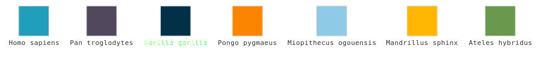
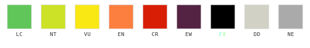
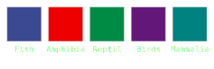
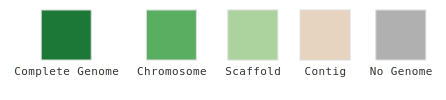
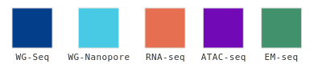

# colour-palettes

Shared colour palettes for mammalian iPSC / primate genomics projects. Plain,
static files — copy-paste or source directly, no build step, no dependencies.

## Palettes

### `species_cols`


### `IUCN_COLOURS`


### `class_col`



### `assembly_levels_cols`


### `seq_type_cols`


## Files

- `palettes.R` — named vectors for R
- `palettes.py` — dicts for Python
- `palettes.json` — universal format for anything else (JS, Illustrator, etc.)
- `add_palette.R` — script to add new palettes

## Usage

**R**, source directly from GitHub:

```r
source("https://raw.githubusercontent.com/mammalian-iPSCs/colour-palettes/main/palettes.R")
```

**Python**, copy `palettes.py` into your project or:

```python
import urllib.request
exec(urllib.request.urlopen(
    "https://raw.githubusercontent.com/mammalian-iPSCs/colour-palettes/main/palettes.py"
).read())
```

**Anything else**, use `palettes.json`.


## Adding a new palette

```r
source("add_palette.R")
```

Then follow the prompts. The script will add your palette to all three files (R, Python, JSON) automatically.
